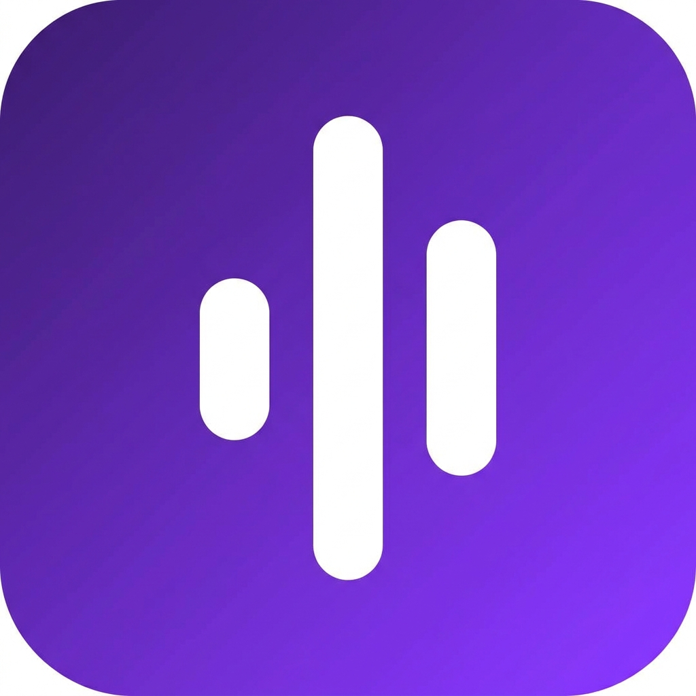

<div align="center">
  
  <h1>ClipScribe</h1>
  <p><strong>Capture what you just heard.</strong></p>
  <p>Retroactive audio transcription for Android — never pause a video to write a note again.</p>

  <a href="https://github.com/lusa8o8/clipscribe/releases"></a>
  <a href="https://github.com/lusa8o8/clipscribe/blob/main/LICENSE"></a>
  <a href="https://github.com/lusa8o8/clipscribe/issues"></a>
  <a href="https://clipscribe.vercel.app"></a>

  <br />
  <br />

  <a href="https://clipscribe.vercel.app/app-debug.apk">
    
  </a>
  &nbsp;
  <a href="https://clipscribe.vercel.app">
    
  </a>
</div>

---

## The Problem

Every time you hear something important in a YouTube clip, TikTok short, lecture, or podcast, you have to:

1. Pause the video
2. Open a notes app
3. Manually type it out
4. Switch back

Then if you want to pass it to an LLM, you type it again.

**ClipScribe eliminates all of that.**

---

## How It Works

ClipScribe runs a silent 60-second audio loop in the background. When you hear something worth saving, you tap the floating bubble overlay — without leaving your current app. ClipScribe instantly grabs the last 60 seconds of system audio, transcribes it via Whisper AI, and saves it to your history. Ready to copy, share, or paste into ChatGPT.

```
Open any app  →  Hear something important  →  Tap the bubble  →  Transcript ready
```

---

## Features

- 🎙️ **Retroactive capture** — grabs the last 60 seconds, no manual recording required
- 🫧 **Floating bubble overlay** — one tap without leaving your active app
- 🤖 **Whisper AI transcription** — powered by `@cf/openai/whisper-large-v3-turbo` on Cloudflare Workers AI
- 🔒 **Private by design** — audio is processed ephemerally and never stored on our servers
- 📋 **Transcript history** — saved locally and synced to the cloud when signed in
- 🌐 **Firebase auth** — anonymous use or Google sign-in for cross-device history

---

## Installation (Android Beta)

> ⚠️ This is a pre-Play Store beta. You will need to allow installation from unknown sources.

**Option 1 — Direct APK download:**
1. Visit [clipscribe.vercel.app](https://clipscribe.vercel.app) on your Android phone
2. Tap **Download Beta APK**
3. Open the downloaded file and tap **Install**
4. Grant audio capture permissions when prompted

**Option 2 — Build from source:**
```powershell
# Requirements: Android SDK, JDK, adb, USB debugging enabled
git clone https://github.com/lusa8o8/clipscribe.git
cd clipscribe
.\scripts\build-debug.ps1
.\scripts\install-debug.ps1
```

---

## Architecture

```
clipscribe/
├── app/
│   └── src/main/java/com/example/
│       ├── capture/          # MediaProjection, rolling audio buffer, freeze flow
│       ├── overlay/          # Floating bubble service and tap handling
│       ├── transcription/    # Audio prep, Cloudflare Workers AI, result holders
│       ├── auth/             # Firebase auth state
│       ├── storage/          # Local + remote transcript store, sync controller
│       └── ui/               # Compose screens (Home, History, Welcome, Permissions)
├── cloudflare-worker/
│   ├── src/index.mjs         # Worker: /transcribe, /transcripts, /waitlist
│   ├── migrations/           # D1 database schema
│   └── wrangler.jsonc        # Cloudflare deployment config
└── website/                  # Vercel landing page
    ├── index.html            # Marketing page with interactive mockup
    ├── privacy.html          # Privacy policy
    └── vercel.json           # Vercel headers + clean URL config
```

---

## Backend (Cloudflare Worker)

The `cloudflare-worker/` directory contains a Cloudflare Worker that handles:

| Endpoint | Method | Description |
|---|---|---|
| `/transcribe` | `POST` | Transcribes WAV audio via Whisper AI — requires Firebase bearer token |
| `/transcripts` | `GET` / `POST` | List or create saved transcripts for signed-in users |
| `/transcripts/:id` | `DELETE` | Delete a specific transcript |
| `/waitlist` | `POST` | Join the launch waitlist |

**Deploy the worker:**
```powershell
cd cloudflare-worker
npx wrangler d1 migrations apply clipscribe_transcripts --remote
npx wrangler deploy
```

**Required Cloudflare bindings:**
- `AI` — Workers AI binding (Whisper)
- `TRANSCRIPTS_DB` — D1 database
- `USAGE_KV` — KV namespace for per-user daily quota tracking

**Required environment variables:**
- `FIREBASE_PROJECT_ID`
- `TRANSCRIPTION_PROVIDER` = `cloudflare-binding`
- `TRANSCRIPTION_MODEL` = `@cf/openai/whisper-large-v3-turbo`
- `FREE_TIER_DAILY_TRANSCRIPT_LIMIT` = `5`

---

## Firebase Setup

Firebase is used for identity (anonymous + Google sign-in).

1. Create a Firebase project at [console.firebase.google.com](https://console.firebase.google.com)
2. Add Android app with package `com.aistudio.clipscribe.vfqmza`
3. Place `google-services.json` at `app/google-services.json`
4. Enable **Anonymous** and **Google** sign-in methods

---

## Website (Vercel)

The landing page lives in `website/` and is deployed to Vercel.

1. Import the repo at [vercel.com](https://vercel.com)
2. Set **Root Directory** → `website`
3. Deploy — no build step needed (pure HTML/CSS/JS)

---

## Privacy

- Audio loop processing is **entirely in-memory** on your device
- The captured audio is sent to Cloudflare Workers AI **only for the duration of the transcription request**
- Raw audio is **never stored** on our servers
- Android's MediaProjection permission triggers the system recording notification — this is expected behaviour, not a bug

Full details: [clipscribe.vercel.app/privacy](https://clipscribe.vercel.app/privacy)

---

## Pricing

| Plan | Price | Transcriptions |
|---|---|---|
| Free Beta | $0 | 5 / day |
| Monthly Pro | $1.99 / month | Unlimited |
| Annual Pro | $9.99 / year | Unlimited + best value |

Join the waitlist at [clipscribe.vercel.app](https://clipscribe.vercel.app).

---

## Contributing

ClipScribe is early-stage and feedback-driven. If you run into a bug, want a feature, or have ideas, email me at lusa@trymyapp.uk or:

1. [Open an issue](https://github.com/lusa8o8/clipscribe/issues)
2. Fork the repo, make your change, and open a PR

---

## License

MIT © 2026 [Lusa Malungisha](https://github.com/lusa8o8)
